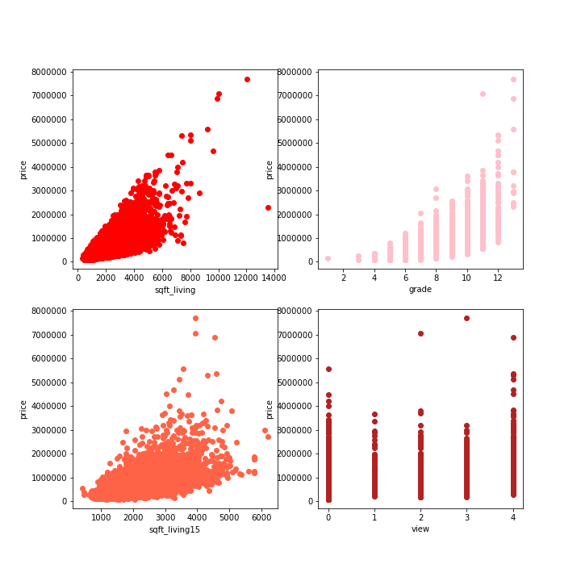

# House Price Prediction

**Authors**: Justin Fernandez

## Overview
This project seeks to answer the question of what characteristics of a house are indicators as to if the price will go up and down. Identifying those key characteristics and how they affect the price of house can be then used to predict the exact price a house will be sold for. The data used is a list of house sales in Kings County CA. with information on each individual house and then the price it was sold for. The methods used in this research will focus on exporation of the data, feature engineering, statistical testing, feature seleciton, and model interpretation. The results of this research show...


## Business Problem
We are assigned with the task of helping a real estate firm guess what their properties will be sold at so they can get an estimate of revenue for the year. We are goint to need to answer some general quesitons in order to gain insight on how we can make thos predictions.
1. What features will help determine the price of a house?
2. What information can we derive from our data that will help us determine the price of the house?
3. What information is not helpful in determining the price of a house?


## Data
The data used in this project comes straing from the sales of these houses. The location for all these houses are Kings County in California. The data set provides information on these houses such as square footage, number of stories, condition, number of bedrooms and bathrooms, and 15 more characterics of the house at time of sale.



## Methods
This project focuses on identifying and engineering features to be used in a linear regression model. This will allow us to identify how each feautre of the house will impact the price of the house when it is to be sold. 
An initial exploratory data analysis was completed in order to determine what was being represented with each original feature. Feature engineering was then completed to possibly create feautres that provide more information then was originaly able to be derived. Statistical tests were then performed in order to answer questions about each feature and its affect to the price. Feature selection was then performed in order to identify the features that had the most influence on the price of the home. Finally the model was interpreted in order to identify the outcomes of the entire process.

## Results
From this process I have identified 100 features that have been able to predict house prices with an RMSE of $187,032. These features were obtained using a the wrapper method of feature selection and linear regression as the scoring mechanism.


## Conclusions

In conclusion, our analysis leads to the following recommendations to Insights:
1. Data like zipcode, longitude, latitude, etc do add information to the model
2. Square footage of the house correlates very highly with the price of a home
3. Creating polynomial features by combining features improves the ability to make accurate predictions
4. Feature selection methods allow a reduction in features and an increase in accuracy of prediction


## Limitations and Next Steps

There were very few limitations with this project but there were some. The data did house outliers which lead to some loss of data. There was some collinearity between some features whihc could have lead to some problems. 

The next steps in this project would be data collection to give a better insight as to where the propety was located to determine if that location could have increased price. Find information about parks, transportation, attractions, and more could have given a better understanding of how its location affected the price. 


## For More Information

Please review our full analysis in [our Jupyter Notebook](./movie-data-analysis.ipynb) or our [presentation](./Movie-Data-Analysis-Presentation.pdf).

For any additional questions, please contact **Justin Fernandez justin.miguel.fernandez@gmail.com**

## Repository Structure

Describe the structure of your repository and its contents, for example:

```
├── README.md                           <- The top-level README for reviewers of this project
├── Bakeoff_modeling_process.ipynb   <- Narrative documentation of analysis in Jupyter notebook
├── Predict_holdout.ipynb                               <- The holdout set for predictions
├── housing_preds_justin_fernandez.ipynb                <- my predictions on the holdout set
├── kc_house_data_test_features.csv                     <- data about housing sales (test set)
├── kc_house_data_train.csv                     <- data about housing sales (train set)
├── model.pickle                     <- pickled linear regression model
├── scaler.pickle                     <- pickled scaler for data
└── images                              <- Both sourced externally and generated from code
```
